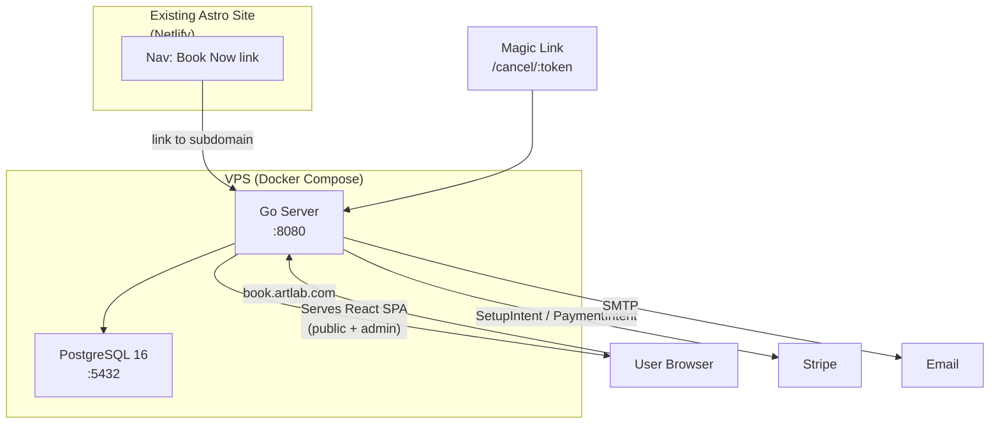

# Resource Booking System (Standalone Project)

A generic, self-hosted resource booking system with hourly post-use billing via Stripe. Designed for community spaces (darkrooms, makerspaces, studios, etc.) and open-sourceable from day one.

## Architecture



## Project Structure (new repo)

```
rebook/                         # working name — configurable
├── cmd/server/main.go          # entrypoint
├── internal/
│   ├── api/                    # HTTP handlers (chi or stdlib mux)
│   │   ├── public.go           # availability, create/cancel booking
│   │   ├── admin.go            # admin CRUD, charge, settings
│   │   └── middleware.go       # CORS, auth, logging
│   ├── db/                     # sqlc-generated queries + migrations
│   │   ├── migrations/         # golang-migrate .sql files
│   │   └── queries/            # sqlc query files
│   ├── stripe/                 # Stripe client wrapper
│   ├── email/                  # SMTP email sender + templates
│   ├── scheduler/              # Goroutine for reminder emails
│   └── config/                 # Env-based config (envconfig)
├── web/                        # React SPA (Vite + React + Tailwind)
│   ├── src/
│   │   ├── pages/              # BookingPage, AdminPage, CancelPage
│   │   ├── components/         # Calendar, TimeSlotPicker, BookingForm, etc.
│   │   └── lib/                # API client, Stripe helpers
│   ├── index.html
│   └── vite.config.ts
├── api/openapi.yaml            # OpenAPI 3.1 spec
├── Dockerfile                  # Multi-stage: Node build + Go build + alpine
├── docker-compose.yml          # api + postgres services
├── .env.example                # All configurable env vars
└── README.md
```

## Database Schema

Four tables, using **golang-migrate** for versioned migrations and **sqlc** for type-safe queries.

- **settings** (single row): resource_name, hourly_rate_cents (default 1500), currency, timezone, bookable_start (e.g. "09:00"), bookable_end (e.g. "21:00"), min_hours, max_hours, reminder_hours_before
- **closures**: id, start_date, end_date, reason, created_at
- **bookings**: id, name, email, start_time (timestamptz), end_time (timestamptz), status (enum: confirmed/cancelled/completed/charged), cancel_token (uuid, unique), stripe_setup_intent_id, stripe_payment_method_id, stripe_payment_intent_id, amount_cents, created_at, updated_at
  - **Exclusion constraint**: `EXCLUDE USING gist (tstzrange(start_time, end_time) WITH &&) WHERE (status NOT IN ('cancelled'))` -- DB-level conflict prevention
- **admin_users**: id, username, password_hash (bcrypt), created_at

## API Design (OpenAPI documented)

### Public Endpoints

| Method | Path | Purpose |
|--------|------|---------|
| GET | `/api/availability?date=YYYY-MM-DD` | Available slots for a date (accounts for bookings, closures, hours) |
| GET | `/api/settings/public` | Resource name, rate, bookable hours (no secrets) |
| POST | `/api/bookings` | Create booking; returns Stripe SetupIntent client_secret |
| GET | `/api/bookings/:token` | View booking via magic link |
| POST | `/api/bookings/:token/cancel` | Cancel booking via magic link |

### Admin Endpoints (session auth)

| Method | Path | Purpose |
|--------|------|---------|
| POST | `/api/admin/login` | Login, returns session cookie |
| GET | `/api/admin/bookings` | List bookings (filterable by date, status) |
| PATCH | `/api/admin/bookings/:id` | Adjust booking (end_time, status) |
| POST | `/api/admin/bookings/:id/charge` | Charge saved payment method (optional custom amount) |
| GET/PUT | `/api/admin/settings` | View/update all settings |
| CRUD | `/api/admin/closures` | Manage closure dates |

### SPA Serving

The Go server serves the built React SPA from an embedded filesystem (`embed.FS`). All non-`/api/` routes fall through to `index.html` for client-side routing.

## Stripe Flow (detailed)

1. **Booking created** -- backend creates a `SetupIntent` and returns `client_secret`
2. **Frontend confirms** -- Stripe.js confirms the SetupIntent, saving the payment method. Backend stores the `payment_method_id`.
3. **After session** -- admin clicks "Charge" in the admin panel, optionally adjusts hours/amount. Backend creates an off-session `PaymentIntent` using the saved payment method.
4. **On cancellation** -- if cancelled before the session, no charge. Payment method can be detached.

## Email

- Templates in Go (`html/template` or `text/template`) embedded via `embed.FS`
- SMTP config via env vars (host, port, user, pass, from address)
- **Confirmation**: booking details, calendar event (.ics attachment), magic cancel link
- **Reminder**: fires N hours before (configurable), sent by a background goroutine with a ticker
- **Cancellation**: confirms the booking was cancelled
- **Receipt**: sent after charge, includes amount and Stripe receipt URL

## Frontend (React SPA)

### Public Pages
- **/** -- Booking page: date picker, visual time-slot grid showing available/booked slots, multi-hour selection, booking form (name, email, Stripe card element)
- **/cancel/:token** -- Shows booking details with confirm-cancel button
- **/booking/:token** -- View booking details (from confirmation email link)

### Admin Pages
- **/admin/login** -- Simple login form
- **/admin** -- Dashboard: today's bookings, upcoming, needs-charge list
- **/admin/bookings** -- Full booking list with filters, charge button, adjust controls
- **/admin/closures** -- Calendar view of closures, add/edit/delete
- **/admin/settings** -- Edit resource name, rate, hours, timezone, reminder timing

### Stack
- Vite + React 19 + TypeScript
- Tailwind CSS (clean, minimal design -- suitable for any brand)
- `@stripe/react-stripe-js` for card input
- `date-fns` for date handling
- `react-router` for client-side routing

## Deployment

- `docker-compose.yml` runs alongside existing Mattermost/Wiki containers on the VPS
- Caddy or nginx reverse proxy: `book.bozemanartlab.com` -> Go container port 8080
- Postgres data persisted via Docker volume
- `.env` file for all configuration (Stripe keys, SMTP, admin credentials, DB URL)
- First-run: `docker compose up` runs migrations automatically on startup

## Changes to artlabweb

Minimal -- just add a "Book Now" link in the nav:
- [src/components/Header.astro](src/components/Header.astro): add link to `https://book.bozemanartlab.com`

## Open-Source Considerations

- All configuration via env vars (no hardcoded branding)
- `resource_name` in settings drives all UI text ("Book the Darkroom" vs "Book the Studio")
- README with clear setup instructions, `.env.example`, and architecture overview
- MIT or Apache-2.0 license
- No vendor lock-in beyond Stripe (which is the standard for this use case)
